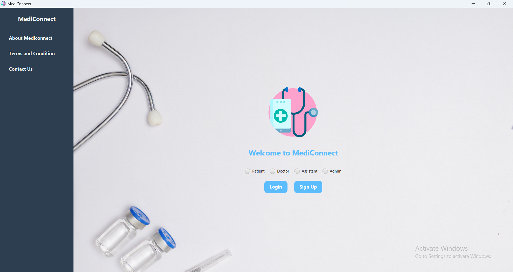
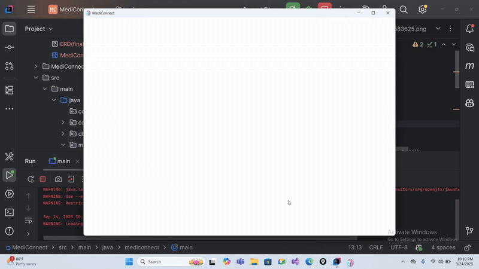
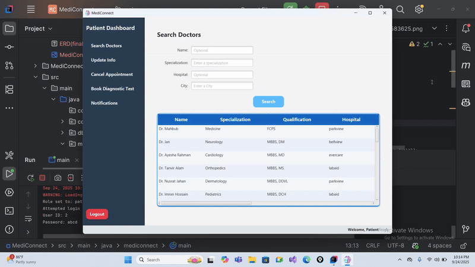
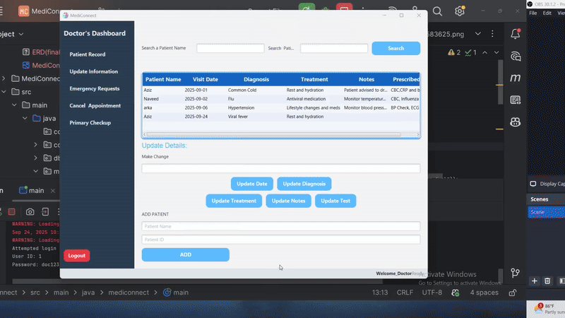

# MediConnect

<!-- Project Welcome Page Screenshot -->

  

---

## 🩺 About the Project

MediConnect is an online healthcare platform where **patients can conveniently book appointments and diagnostic tests from home**.  
This project was built as part of **CSE-252 (Database Management Systems Sessional)** and **CSE-202 (Software Development with Java)**.

---

## ⚙️ Built With

- Java
- JavaFX
- MySQL
- ❤️ (Love and passion)

---

## 🗂️ Database ERD

  

---

## ✨ Features

### 🔐 Role-Based Login & Signup
- Secure login and signup for **Patient**, **Doctor**, **Admin**, and **Assistant**.

  

---

### 🧑‍⚕️ Patient Dashboard
**Features for Patients:**
- Book appointments
- Book diagnostic tests
- Request emergency appointments

  

---

### 👨‍⚕️ Doctor Dashboard
**Features for Doctors:**
- Add and view patients' medical records
- Cancel appointments
- Handle emergency appointment requests
- View primary checkup details

  

---

## 👥 Project Team

- [Naveed Wazed Khan](https://github.com/Naveed2204016) : 2204016  
- [Arka Dutta](https://github.com/ADUTTA108) : 2204025
- [Ramij Wasith Rahat](https://github.com/Mr-Wasith) : 2204022
- [Abdul Aziz Abid](https://github.com/abdulazizabid) : 2204023

---

## 🧑‍🏫 Project Supervisors
- Md Atiqul Islam Rizvi
- Sharmistha Chanda Tista

---
